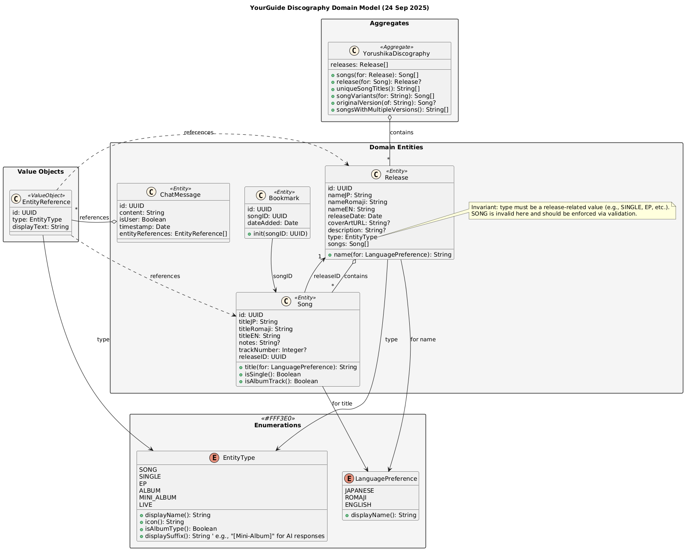

# 🎶 YoruGuide  
_A fan-created Yorushika Catalog & AI‑Powered Interactive Guide_


---

## 📑 Table of Contents  
- [📖 Overview](#-overview)  
- [🎮 Live Demo](#-live-demo)  
- [🎯 Goals](#-goals)  
- [🗂 Data Model](#-data-model)  
- [🛠 Tech Stack](#-tech-stack)  
- [📱 Features](#-features)  
- [🤖 AI Assistant](#-ai-assistant)  
- [🚀 Getting Started](#-getting-started)  
- [🧩 Engineering Highlights](#-engineering-highlights)  
- [🙌 Credits](#-credits)  
- [🛤 Roadmap](#-roadmap)  

---

## 📖 Overview  

**YoruGuide** is a comprehensive fan‑made iOS & visionOS app that presents the entire catalog of **Yorushika (ヨルシカ)** works, including:  
- Albums & songs (JP / Romaji / EN)  
- Translations & annotations  
- Trivia and backstories  

### Core Features  
- 🌸 **Bookmark songs** for quick access  
- 🤖 **AI Assistant (powered by POE API)** — ask questions about Yorushika, with smart answers that reference in‑app pages  
- 🔗 **Clickable answers** inside AI responses that link directly to the relevant **Song** or **Album** page  

⚠️ **Disclaimer:** This project is **fan‑made and non‑commercial**. All original music and rights belong to Yorushika and official publishers.  

---

## 🎮 Live Demo
You can try YoruGuide instantly in your browser via Appetize.io:

[](https://yorushika.com)



## 🎯 Goals  

- Build a **data‑driven catalog app** with iOS & visionOS interfaces  
- Enable **natural language Q&A** with contextual references  
- Provide easy **bookmarking and favorites** features  
- Explore **immersive visionOS** experiences with RealityKit  

---

## 🗂 Data Model  

The dataset originates from the community‑maintained  
[Yorushika Song Spreadsheet (Google Sheets)](https://docs.google.com/spreadsheets/d/1sqwarEZIDQo4eTnnnQaQb0RgZJGdZrW8hEp8WbfVDlQ),  
extended with curated trivia and fan notes.  


---

## 🛠 Tech Stack  

- **Swift / SwiftUI** — iOS & visionOS UIs  
- **SwiftData** — persistence for bookmarks & notes  
- **POE API** — intelligent Q&A engine  
- **visionOS + RealityKit** — immersive 3D gallery UI  
- **MVVM Architecture** — clean separation of app layers  

---

## 📱 Features  

### iOS  
- Full catalog of **songs & albums** with translations  
- **Search** across Japanese, Romaji, and English song names  
- Detailed song pages with **trivia & notes**  
- **Bookmarks** saved via SwiftData  

### visionOS  
- Immersive **3D album gallery wall**  
- Tap/gesture → open album or song detail floating panel  
- AI answers link directly to **SongDetailView** / **AlbumView**  

---

## 🤖 AI Assistant  

The AI assistant uses **POE API** and is trained to reference internal app entities such as songs or albums.  
Responses can include **clickable components** that open the corresponding in‑app page.  

### Example Conversations  

```text
User: What's the most streamed song in the Elma album?  
App: It is "Rain with Cappuccino" → [Open Song Page]
```

```text
User: What's the story behind *Plagiarism*?  
App: 
這次的故事主角設定上是一名小偷，在小時候母親就因為無法忍受酒鬼父親而拋棄主角離家出走，因此便造就了主角不渴望親情、不渴望一切的個性。...  
從此他決定成為音樂小偷，創作一些對其他歌曲加以改編的歌。 → [Open Album Page: Tousaku]
```

```text
User: Generate a playlist suitable for workout  
App: Here's a suggested 5‑song workout playlist:  
- "Replicant" → [Song Page]  
- "Bakudanma" → [Song Page]  
- "Thought Crime" → [Song Page]  
- "Fireworks Beneath My Shoes" → [Song Page]  
- "Rain with Cappuccino" → [Song Page]
```

```text
User: What's the latest song?  
App: The latest entry in Yorushika’s catalog is **"アルジャーノン (Algernon)"** from the *Gentou (Magic Lantern)* collection. → [Song Page: Algernon]
```

```text
User: What's special about *Itte* in Yorushika fandom?  
App: Fans consider **"Itte"** (言って。/ Say it.) one of the emotional highlights of the *Summer Grass Gets in the Way* album.  
The song went viral for its poignant lyrics, expressive vocals, and themes of love and loss. → [Song Page: Itte]
```

---

## 🚀 Getting Started  

1. Clone this repository  
   ```bash
   git clone https://github.com/jim-books/YoruGuide.git
   cd YoruGuide
   ```
2. Open with **Xcode 15+**  
3. Run on iOS 17+ Simulator or **visionOS Simulator**  
4. Add your **POE API key** to `Config.plist`  

---

## 🧩 Engineering Highlights  

- **Entity‑linked AI:** every AI response maps to a `Song` or `Album` ID for in‑app navigation  
- **Data migration ready:** Google Sheets → JSON → SwiftData seed  
- **Cross‑platform reuse:** shared presentation logic across iOS & visionOS  
- **visionOS immersion:** RealityKit‑powered gallery with song detail overlays  

---

## 🙌 Credits  

- **Yorushika** — the inspiration and all their music  
- **Community translators & fans** — spreadsheet data & annotations  
- **Created by [Jimmy Hung](https://linkedin.com/in/jimmyhkh)** — as a SwiftUI & visionOS engineering showcase with AI  

---

## 🛤 Roadmap  

- [ ] Add listening stats via Spotify / YouTube APIs  
- [ ] Extend AI with **playlist export** (Apple Music / Spotify)  
- [ ] Enable iCloud sync for bookmarks  
- [ ] Add **relationship map view** between albums and stories  
- [ ] Write technical blog: *“AI‑Linked SwiftUI: Building Entity‑Aware Assistants in iOS & visionOS”*  
```
